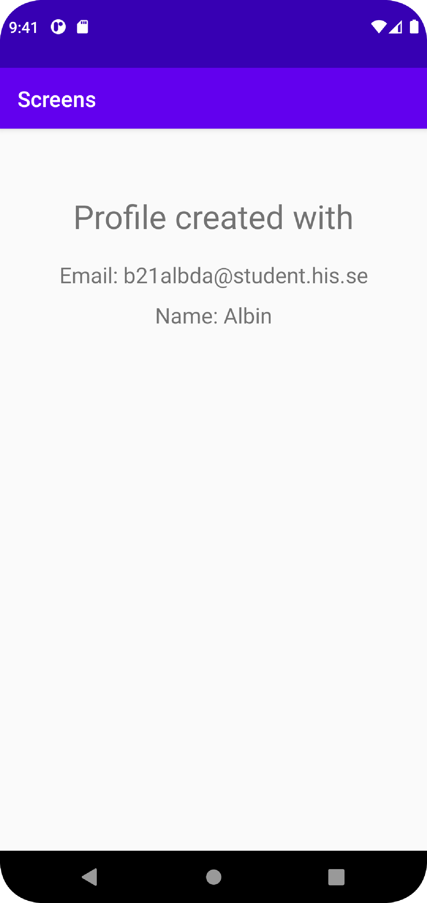

# Rapport

Skapade en second activity som visar om en profil har skapats eller inte. Om en profil har skapats visas emailen och namnet som användaren
tillhandahöll i föregående activity.

Nedanstående kod ser till att extras har skickats med och sparar isåfall dem i en sträng
Koden ser även till att de medskickade extras inte är tomma vilket skulle leda till att en profil inte kan skapas,
detta meddelas då till användaren. Är extras inte tomma meddelas användaren att en profil blev skapad med emailen och namnet

```
Bundle extras = getIntent().getExtras();
    if (extras != null) {
        String email = extras.getString("EMAIL");
        String name = extras.getString("NAME");

        if (email.isEmpty() || name.isEmpty()) {
            statusMsg.setText("Profile could not be created");
        }
        else {
            statusMsg.setText("Profile created with");

            TextView emailView = findViewById(R.id.email);
            TextView nameView = findViewById(R.id.name);

            emailView.setText("Email: " + email);
            nameView.setText("Name: " + name);
        }
    }
```

Bilder läggs i samma mapp som markdown-filen.





Läs gärna:

- Boulos, M.N.K., Warren, J., Gong, J. & Yue, P. (2010) Web GIS in practice VIII: HTML5 and the canvas element for interactive online mapping. International journal of health geographics 9, 14. Shin, Y. &
- Wunsche, B.C. (2013) A smartphone-based golf simulation exercise game for supporting arthritis patients. 2013 28th International Conference of Image and Vision Computing New Zealand (IVCNZ), IEEE, pp. 459–464.
- Wohlin, C., Runeson, P., Höst, M., Ohlsson, M.C., Regnell, B., Wesslén, A. (2012) Experimentation in Software Engineering, Berlin, Heidelberg: Springer Berlin Heidelberg.
